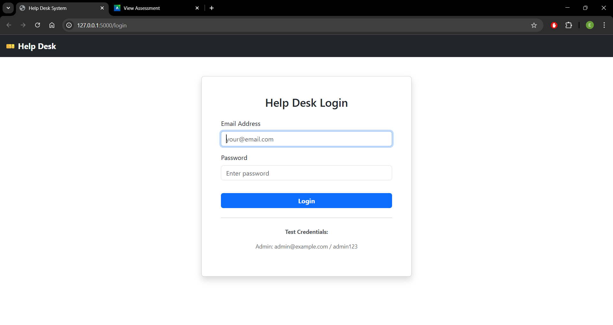
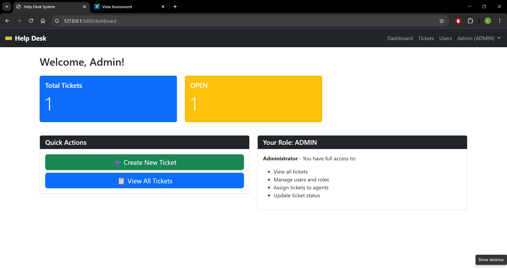
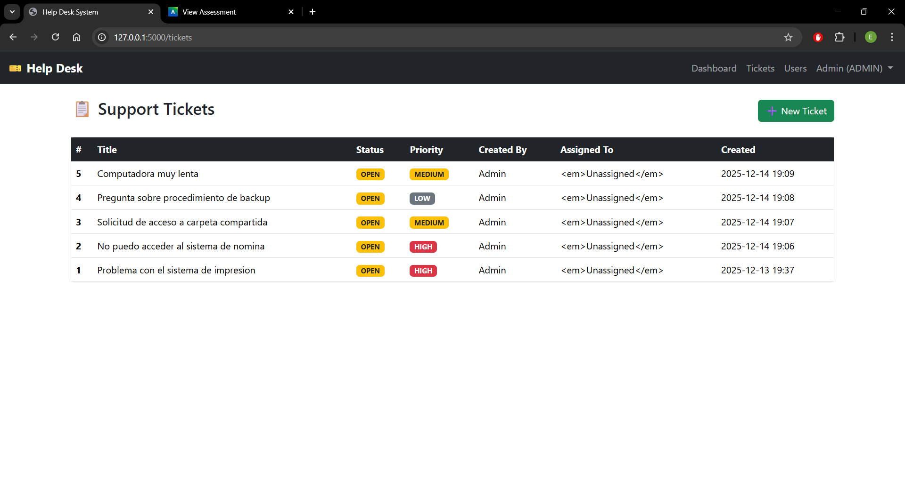
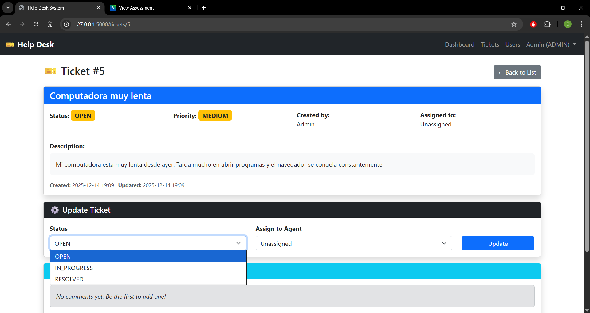
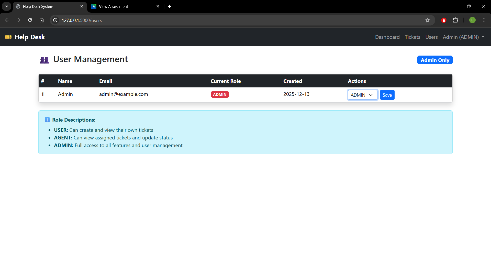

# 🎫 Help Desk System

Sistema de soporte técnico full-stack desarrollado con Flask, MariaDB, Bootstrap y jQuery.


## 📋 Descripción

Sistema web de gestión de tickets de soporte técnico que permite a los usuarios reportar problemas, a los agentes gestionarlos y a los administradores supervisar todo el proceso.

### ✨ Características Principales

- ✅ **Gestión de Tickets:** Crear, actualizar y resolver tickets de soporte
- 👥 **Sistema de Roles:** Admin, Agente y Usuario con permisos diferenciados
- 💬 **Comentarios:** Sistema de comunicación en tiempo real
- 📊 **Dashboard:** Estadísticas y resumen de tickets
- 🔒 **Seguridad:** Autenticación robusta y protección contra SQL injection
- 📱 **Diseño Responsivo:** Compatible con dispositivos móviles
- ⚡ **Interfaz Interactiva:** Mejorada con jQuery

## 🛠️ Tecnologías Utilizadas

### Backend

- **Flask** - Framework web Python
- **PyMySQL** - Conector base de datos
- **Werkzeug** - Hashing de contraseñas
- **Python-dotenv** - Gestión de variables de entorno

### Frontend

- **Bootstrap 5.3.3** - Framework CSS
- **jQuery 3.7.1** - Biblioteca JavaScript
- **Jinja2** - Motor de templates

### Base de Datos

- **MariaDB 10.x** - Sistema de gestión de bases de datos

## 📁 Estructura del Proyecto

```
helpdesk_app/
├── app.py                    # Aplicación principal
├── config.py                 # Configuración
├── requirements.txt          # Dependencias
├── .env.example             # Plantilla variables de entorno
├── templates/               # Templates HTML
│   ├── base.html
│   ├── login.html
│   ├── dashboard.html
│   ├── tickets_list.html
│   ├── ticket_detail.html
│   ├── ticket_new.html
│   └── users_list.html
├── static/
│   ├── css/custom.css       # Estilos personalizados
│   └── js/main.js           # JavaScript/jQuery
└── docs/
    ├── manual_usuario.md    # Manual de usuario
    ├── manual_tecnico.md    # Documentación técnica
    ├── er_diagram.png       # Diagrama ER
    └── screenshots/         # Capturas de pantalla
```

## 🚀 Instalación

### Requisitos Previos

- Python 3.8 o superior
- MariaDB 10.3 o superior
- Git

### Paso 1: Clonar el Repositorio

```bash
git clone https://github.com/tu-usuario/helpdesk-app.git
cd helpdesk-app
```

### Paso 2: Crear Entorno Virtual

```bash
# Crear entorno virtual
python -m venv venv

# Activar entorno virtual
# Windows:
venv\Scripts\activate
# macOS/Linux:
source venv/bin/activate
```

### Paso 3: Instalar Dependencias

```bash
pip install -r requirements.txt
```

### Paso 4: Configurar Base de Datos

```bash
# Acceder a MariaDB
mysql -u root -p

# Ejecutar el script SQL (ver docs/manual_tecnico.md para el script completo)
```

### Paso 5: Configurar Variables de Entorno

Crear archivo `.env` en la raíz del proyecto:

```env
SECRET_KEY=tu_clave_secreta_muy_larga_y_segura
DB_HOST=localhost
DB_USER=root
DB_PASSWORD=tu_password
DB_NAME=helpdesk_db
```

### Paso 6: Crear Usuario Administrador Inicial

```python
# Generar hash de contraseña
from werkzeug.security import generate_password_hash
print(generate_password_hash("admin123"))
```

```sql
# Insertar en la base de datos
INSERT INTO users (name, email, password_hash, role)
VALUES ('Admin', 'admin@example.com', 'HASH_AQUI', 'ADMIN');
```

### Paso 7: Ejecutar la Aplicación

```bash
python app.py
```

Abrir navegador en: **http://localhost:5000**

## 🔑 Credenciales de Acceso Inicial

- **Email:** admin@example.com
- **Contraseña:** admin123

⚠️ **Importante:** Cambiar estas credenciales después del primer acceso.

## 📸 Capturas de Pantalla

### Login



### Dashboard



### Lista de Tickets



### Detalle de Ticket



### Gestión de Usuarios (Admin)



## 👥 Roles y Permisos

### 👤 USER (Usuario)

- Crear tickets de soporte
- Ver sus propios tickets
- Agregar comentarios

### 🛠️ AGENT (Agente)

- Ver tickets asignados
- Actualizar estado de tickets
- Asignar tickets
- Agregar comentarios

### 👑 ADMIN (Administrador)

- Acceso completo al sistema
- Gestionar usuarios y roles
- Ver todos los tickets
- Supervisión general

## 🗃️ Modelo de Base de Datos

```
┌─────────────┐       ┌──────────────┐       ┌──────────────────┐
│   users     │←─────→│   tickets    │←─────→│ ticket_comments  │
└─────────────┘       └──────────────┘       └──────────────────┘
```

Ver diagrama completo en: `docs/er_diagram.png`

## 📚 Documentación

- **[Manual de Usuario](docs/manual_usuario.md)** - Guía completa para usuarios finales
- **[Manual Técnico](docs/manual_tecnico.md)** - Documentación técnica y arquitectura

## 🔒 Seguridad

- ✅ Contraseñas hasheadas con bcrypt
- ✅ Protección contra SQL injection
- ✅ Autenticación basada en sesiones
- ✅ Control de acceso basado en roles
- ✅ Variables de entorno para credenciales sensibles

```

```
